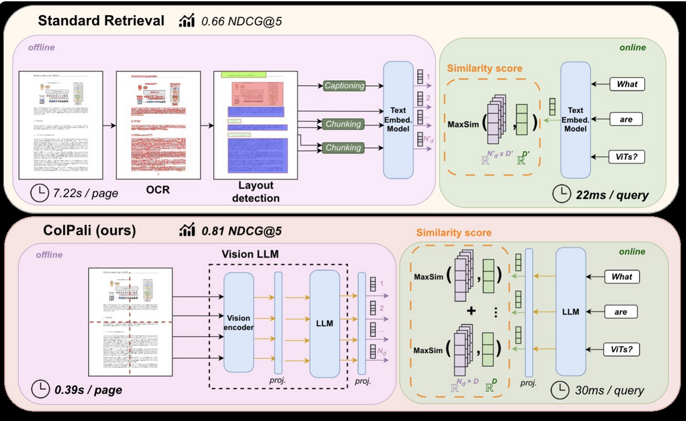
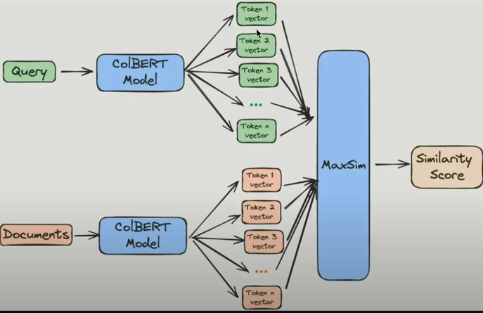
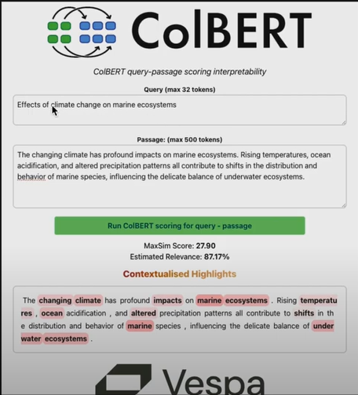
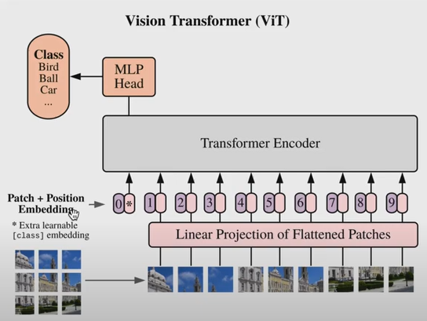
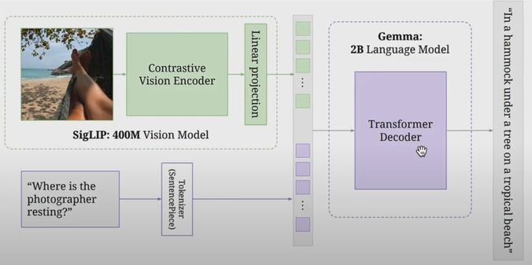

# Colpali: How It Works

## Composition of Colpali

### 1. ColBERT

ColBERT is a retrieval model that improves efficiency and accuracy through:

- **Token-Level Representation:** ColBERT maintains individual embeddings for each token, allowing for fine-grained retrieval.
- **Late Interaction Mechanism:** ColBERT employs a late interaction strategy, where queries and documents are processed separately until the final retrieval stage.

### 2. PaliGemma

PaliGemma is a lightweight (3B) model that combines:
- A vision model (**SigLIP-SO400M**) and 
- A language model (**Gemma-2B**)

Transformers, the backbone of LLMs, have been successfully applied not only to text but also to vision, where images are split into fixed-size patches. PaliGemma integrates these models by connecting them with a linear layer for seamless interaction.

## Offline Indexing

Offline indexing is a one-time, computationally intensive process where documents are preprocessed and indexed into a retrievable format.

### Steps:
1. All document pages are processed into 1030 patches. These flattened image patches (128 dimensions each) are fed into the SigLIP vision encoder.
2. An intermediate projection layer between SigLIP and Gemma-2B maps image tokens into a shared embedding space.
3. The image patches are then passed into the Gemma-2B decoder to generate contextualized representations.
4. An additional projection layer maps the output of the Gemma-2B language model embedding into a lower-dimensional (d=128) vector space, similar to ColBERT’s approach for lightweight embedding representation.
5. These embeddings are indexed locally or stored in vector databases that support ColBERT-style embeddings, such as Vespa or LintDB.

## Online Querying

This is the online phase where inference must be fast and responsive for an optimal user experience when a search query is submitted.

### Steps:
1. The query is encoded by the language model on the fly.
2. A late interaction mechanism, similar to the ColBERT ranking model, computes the maximum similarity score between the query embeddings and pre-indexed document embeddings.
3. Finally, Colpali returns the top-k similar results (images), which can be further processed by a multimodal LLM along with the user query to generate an interpretable response about the table, text, or images.

---

_This README provides an overview of how Colpali functions. For implementation details and usage, refer to the documentation in the repository._
